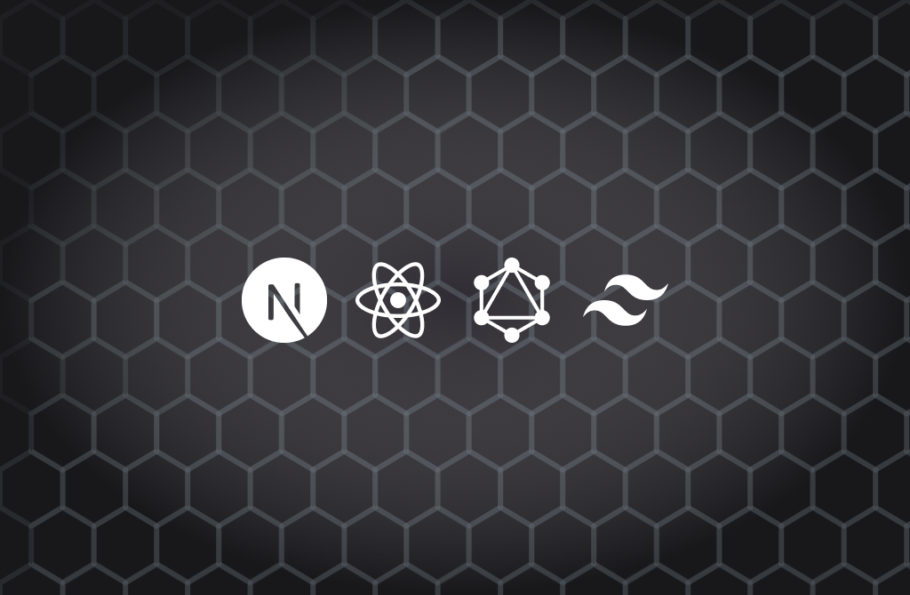

<p align="center">
  <a href="" rel="noopener">
 </a>
</p>

<h3 align="center">Case study: GraphQL</h3>

<div align="center">
    <a href="https://yuki2dev-study-graphql.vercel.app/">
    
    </a>
    <br> 
    
</div>

---

<p align="center"> Case study: Simple GraphQL + GraphCMS application
    <br> 
</p>

## 📝 Table of Contents
- [About](#about)
- [Getting Started](#getting_started)
- [Deployment](#deployment)
- [Built Using](#built_using)
- [Authors](#authors)

## 🧐 About <a name = "about"></a>
Simple project using GraphQL and GraphCMS with the main objectives of learning GraphQL and use a Content Management System like GraphCMS.

## 🏁 Getting Started <a name = "getting_started"></a>

### Installing
```
yarn install
```

### Setup
Change the GraphCMS url on `/src/libs/urql.ts`
```js
import { cacheExchange, createClient, dedupExchange, fetchExchange, ssrExchange } from "urql";


const isServerSide = typeof window === 'undefined';
const ssrCache = ssrExchange({ isClient: !isServerSide });

const client = createClient({
    url: "<YOUR_GRAPHCMS_CONTENT_ENDPOINT_API>",
    exchanges: [dedupExchange, cacheExchange, ssrCache, fetchExchange]
})


export { client, ssrCache };
```

### Running
Run the development enviroment
```
yarn dev
```

Access `localhost:3000`

## 🚀 Deployment <a name = "deployment"></a>
Deploy on vercel

[](https://vercel.com/new/clone?repository-url=https%3A%2F%2Fgithub.com%2FKeysHD%2Fstudy-graphql)

## ⛏️ Built Using <a name = "built_using"></a>


## ✍️ Authors <a name = "authors"></a>
- [@Yuki2dev](https://github.com/KeysHD)